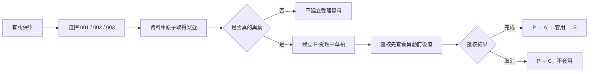
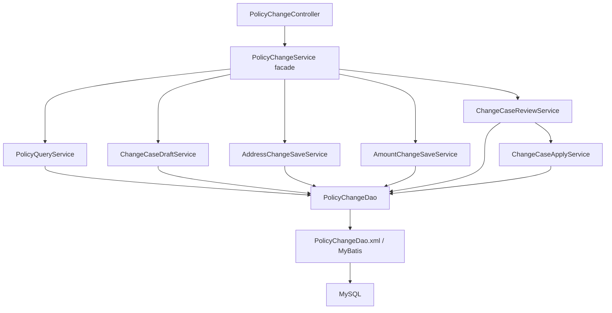

# POS Change API 保全變更後端

`pos-change-api` 提供保單查詢、保全變更草稿、案件查詢與覆核回寫 API。前端可以先取得案號，但只有真的修改資料時，後端才建立受理檔與異動明細。

## 功能流程



### 變更項目

- `001`：地址、email、電話或手機變更。
- `002`：主約保額變更，同時記錄保單主檔與主約列。
- `003`：附約保額變更，以 `rideOrder` 定位正確附約。

### 受理狀態

- `P`：受理中，等待覆核。
- `A`：覆核交易套用中，只供後端原子鎖定使用。
- `S`：完成，異動已回寫。
- `C`：取消，異動不回寫。

覆核完成使用條件更新將 `P` 改成 `A`。只有成功鎖定案件的交易能套用資料，再將 `A` 改成 `S`，可避免兩位覆核人員同時完成同一案件。

## 案號規則

格式為：

```text
C + 民國年 3 碼 + 月 2 碼 + 日 2 碼 + 流水號至少 3 碼
```

例如 `C1150712001`。流水號由 `policy_change_case_sequence` 使用 MySQL 原子遞增與 connection-local `LAST_INSERT_ID()` 取得，支援多執行緒、多 Pod 與服務重啟；超過 `999` 後會自然成長為四碼以上。

取號只保留流水號，不會建立 `policy_change_acceptance`。實際儲存且有異動時才建立受理資料。

## 草稿規則

`policy_change_field` 與 `policy_change_file` 使用商業唯一鍵保存目前有效草稿：

- 欄位草稿：案號、項目、欄位名稱與 `change_key` 唯一。
- 檔案快照：案號、項目、檔案名稱與 `change_key` 唯一。
- 重複儲存同一目標會更新最新值，不會累積多筆有效版本。
- 改回原值時會刪除該目標草稿；案件已無任何異動時，一併移除受理資料。

`change_key` 用來定位資料列：

- 地址：`address_type`。
- 主檔：`MASTER`。
- 主約列：`000`。
- 附約：`ride_order`。

## 覆核衝突

覆核套用前會比較主檔目前值與草稿的 `content_before`：

- 值相同才允許套用。
- 比較與回寫期間使用 `SELECT ... FOR UPDATE` 鎖定目標資料列；主附約固定先鎖主檔、再依序鎖附約。
- 若其他案件已先修改同一地址、主約或附約，回傳 HTTP `409 Conflict`。
- 每次回寫都檢查 affected row 必須為 1，避免資料不存在時仍顯示完成。
- 整個覆核在同一交易內執行；任何一項失敗都會回復案件狀態與主檔更新。

## API

所有成功與錯誤回覆都使用 `ResponseBodyDto<T>`；request body 不包 `ResponseBodyDto`。

| API | 畫面 | 用途 |
| --- | --- | --- |
| `GET /api/auth/me` | 登入頁 | 驗證帳號並取得 MAKER / REVIEWER 角色。 |
| `GET /api/policies/{policyNo}/{policySeq}` | 新增頁 | 查詢主檔、地址、主附約與代碼。 |
| `GET /api/postal-codes/{postalCode}` | 地址 Dialog | 查詢 3 或 3+3 郵遞區號地址前綴。 |
| `POST /api/change-cases` | 新增頁 | 原子取得案號，不建立受理資料。 |
| `POST /api/change-cases/{caseNo}/address-change` | 001 Dialog | 儲存地址或聯絡資料草稿。 |
| `POST /api/change-cases/{caseNo}/main-amount-change` | 002 Dialog | 儲存主約保額草稿。 |
| `POST /api/change-cases/{caseNo}/policies/{policyNo}/{seq}/rider-amount-change` | 003 Dialog | 儲存附約保額草稿。 |
| `GET /api/policies/{policyNo}/change-cases` | 查詢／覆核頁 | 查詢案件清單。 |
| `GET /api/policies/{policyNo}/{seq}/change-cases/{caseNo}` | 查詢／覆核頁 | 查詢欄位與檔案快照異動前後值。 |
| `PATCH /api/change-cases/{caseNo}/status` | 覆核頁 | REVIEWER 將案件改成 `S` 或 `C`。 |

## 架構



後端維持三層：

- Controller：HTTP、Bean Validation 與 `ResponseBodyDto`。
- Service：use case、交易與商業規則；每個 Service 都有 interface。
- DAO：`PolicyChangeDao` 由 MyBatis 直接建立代理，不再保留純轉呼叫的 DAO implementation 與 Mapper interface。

`PolicyChangeServiceImpl` 是薄 facade，不重複實作各 use case。

## 資料庫版本

資料庫結構由 Flyway 管理：

- `db/migration/V1__baseline.sql`：核心資料表、代碼與郵遞區號。
- `db/migration/V2__harden_change_case_workflow.sql`：原子流水號、草稿唯一鍵與更新時間。
- `db/local/R__demo_policy.sql`：只在 `local` profile 建立示範保單。

正式環境不要手動重跑舊 `schema.sql`。資料庫本身需先建立，啟動時由 Flyway 套用尚未執行的版本。

## Security 與 CORS

本機預設可設定 `POS_SECURITY_ENABLED=false`。正式環境使用 `prod` profile，必須設定：

```text
POS_SECURITY_ENABLED=true
POS_MAKER_USERNAME
POS_MAKER_PASSWORD
POS_REVIEWER_USERNAME
POS_REVIEWER_PASSWORD
```

- `MAKER`：查詢、取號、儲存 001／002／003。
- `REVIEWER`：查詢案件明細、完成或取消案件。
- 未登入回覆 `401 ResponseBodyDto`，角色不符回覆 `403 ResponseBodyDto`。
- CORS 來源由 `CORS_ALLOWED_ORIGINS` 以逗號分隔設定。

資料庫帳密沒有程式預設值，必須由環境變數或 Secret 提供：

```text
DB_URL
DB_USERNAME
DB_PASSWORD
```

## 本機啟動

```bash
export SPRING_PROFILES_ACTIVE=local
export DB_URL='jdbc:mysql://localhost:3306/main?serverTimezone=Asia/Taipei&characterEncoding=utf-8'
export DB_USERNAME='your-user'
export DB_PASSWORD='your-password'
mvn spring-boot:run
```

預設 API：`http://localhost:8081`。

健康檢查：

```text
GET /actuator/health/liveness
GET /actuator/health/readiness
```

## 測試與 CI

```bash
mvn test
mvn clean verify
```

- 一般單元測試不連本機 MySQL。
- `SecurityAuthorizationTest` 驗證 401/403 `ResponseBodyDto`、MAKER/REVIEWER 分權、登入身份與 CORS origin。
- `PolicyChangeWorkflowIntegrationTest` 使用 MySQL Testcontainers 驗證 Flyway、原子案號、無異動、重複儲存、過期案件及兩案同時覆核衝突。
- Docker 未啟動時整合測試會略過；GitHub Actions 的 Docker 環境會完整執行。
- `.github/workflows/ci.yml` 在 push 與 pull request 執行 `mvn clean verify`。

## Docker

```bash
docker build -t pos-change-api:latest .
```

Dockerfile 使用 BuildKit cache 保存 Maven 本機倉庫，直接執行專案建置；不先跑 `dependency:go-offline`，避免下載未使用的 BOM 與外部資料庫驅動。

前後端與 MySQL 建議由 `pos-web/compose.yaml` 一起啟動，避免 port、network 與資料庫環境設定不一致。

## SQL Log 與個資

MyBatis 原始參數 log 維持關閉：

```properties
mybatis.configuration.log-impl=org.apache.ibatis.logging.nologging.NoLoggingImpl
logging.level.com.alin.lin.dao=info
```

Debug SQL 統一由 `MaskedSqlLogInterceptor` 輸出，保單號碼、地址、email、電話與手機會遮罩。Log 同時輸出 stdout 與 rolling file；容器或 K8s 應以 stdout 收集為主。
